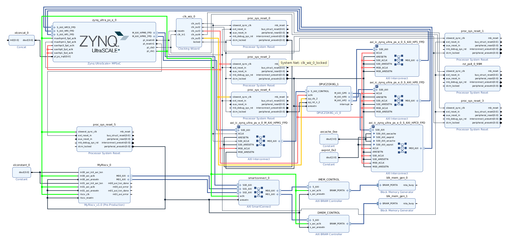

# aiedge6

The implementation of the [6th AI Edge Contest on SIGNATE](https://signate.jp/competitions/732) of team Vertical-Beach.

  

Target board is [Xilinx Kria KV260](https://www.xilinx.com/products/som/kria/kv260-vision-starter-kit.html).
[Xilinx DPU](https://www.xilinx.com/products/intellectual-property/dpu.html) and [VexRiscv](https://github.com/SpinalHDL/VexRiscv) are implemented in PL region.

- `app/`: The application running on KV260. The compiled DNN model running on DPU is included.  
- `hardware/`: Hardware files for KV260. Bitstream and device tree files are included.
- `riscv_code/`: Source codes that run on the VexRiscv core and host code that controls VexRiscv core.
- `visualize_util/`: Point cloud visualize tool usingn Open3D.
- `signate_docker`: Docker environment for submitting to the contest's automated scoring system.
- `report`: A report describing the details and usage of our system. written in Japanese. 

# Referece

[lp6m/VexRiscv_Ultra96](https://github.com/lp6m/VexRiscv_Ultra96)
[Vertical-Beach/ai-edge-contest-5](https://github.com/Vertical-Beach/ai-edge-contest-5)
