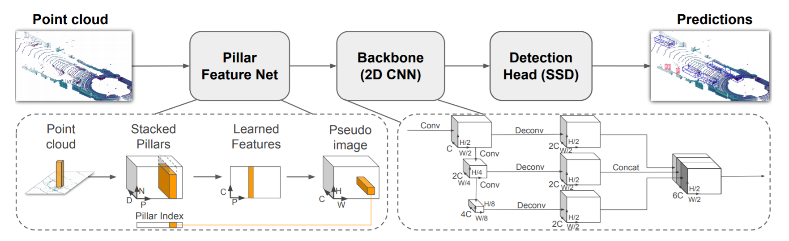

# 第6回 AIエッジコンテスト Vertical-Beach レポート

## 最終成果物概要
- 対象ボード: KV260
- 点群物体検出アルゴリズム: Pointpillars
    * 前方方向の画像は使用せず全方位の点群のみを使用
- HW構成: Xilinx DPU + VexRiscv
- RISCVアーキテクチャ: rv32imfac
- RISCV動作周波数: 150MHz
- RISCV独自追加命令: なし
- RISCVで実行される処理: 点群のVoxelize処理の一部
- 使用開発環境: Vivado/Vitis/Petalinux 2022.1 Vitis-AI v2.5 VexRiscv
- 最終成果物の公開予定リポジトリ: [https://github.com/Vertical-Beach/ai-edge-contest6](https://github.com/Vertical-Beach/ai-edge-contest6)

## 最終成果物処理性能
- 推論時間: 790[ms]
  * RISCVなし: 375ms
- 精度指標(SW): 0.2911211

### 推論時間について
1つの点群ファイルを読み込んでから推論結果を出力するまでの時間は790msとなった。
最終成果物ではRISCVコアに点群データのVoxelize処理の一部をオフロードしているが、HW構成の都合上、1回の点群データに対する推論において約350回ほどRISCVコアを実行する必要がある。（詳細についてはHW構成の章に記載する。）ARMコアとRISCVコア間でのデータ転送時間が長く、RISCVコアを使用することで大幅に実行時間が長くなってしまっている。  
RISCVコアを使用しない場合、推論時間は375msとなった。このうち推論時間のほとんどをXilinx DPUによるDNNモデルの推論処理時間が占めている。

### 精度指標について 
これまでのAIエッジコンテストでは評価用入力データが配布されており、入力に対する推論結果データをアップロードすることでSIGNATE上のシステムで精度評価が行われていた。今回のコンテストでは評価用入力データは配布されず、指定のdockerコンテナ内で動作するソフトウェアをアップロードすることでシステム上でSWが実行され精度評価が行われる。  

SWで実装したDNNモデルをHW実装する際、実装の差異やモデルの量子化などにより一般に精度が劣化するが、HWでの実行をSIGNATEの評価システム上で実行することは困難なため、HW実装する前のSW実装の性能をここに表記する。

## 開発方針
前回の第5回AIエッジコンテストでの経験を活かし、Xilinx DPU + VexRiscvの構成をKV260上に実装した。
点群データに対するAI処理の経験がなかったため、SWレベルの開発に時間を要した。点群データや推論結果の可視化プログラムの開発を最初に行い、続いてXilinx DPUを含めたブロックデザインの作成をし、最後にVexRiscvを追加した。  
モデルの再学習やモデルの改変は開発期間の都合上間に合わなかった。

## DNNモデル
使用したDNNモデルは[Xilinx Model Zoo](https://github.com/Xilinx/Vitis-AI/tree/v2.5/model_zoo)で公開されている`pt_pointpillars_nuscenes_40000_64_108G_2.5`を使用した。本コンペで提供された学習データは使用せずに、Model Zooで公開されているモデルファイルをそのまま使用している。本モデルの実装には、多用な物体検出モデルの実装を比較的簡単に行える[mmdetection](https://github.com/open-mmlab/mmdetection3d)フレームワークをベースにソースコードをXilinx DPU向けに一部改変したものが用いられている。

PointPillarsは点群データを格子状に分割し、疑似画像を作成することで物体検出の要領で点群物体検出を行う。

Convolution処理としては`Pillar Feature Net`と`BackBone+Detection Head`の2つに分かれており、Xilinx DPUではそれぞれ2つのモデルを順番に実行する。以下にXilinx DPUで実行される2つのモデルの構成図を示す。  

## HW構成
作成したブロックデザインを以下に示す。  

ブロックデザインの作成手順は、まずVexRiscvを搭載したブロックデザインをVivado上で作成し、そのブロックデザインをVitisのプラットフォームプロジェクトとして登録しておく。Vitisを使用してプラットフォームプロジェクトを選択し、DPUの構成やクロック情報を記述してVitisプロジェクトをビルドすると上記のブロックデザインがVitisによって自動生成される。なお、Vitisを使用してKV260上にDPUを実装する手順については下記の記事にまとめている:  
[KV260向けにVitisプラットフォームを作成してDPUを動かす その1 (Vitis 2022.1 + Vitis-AI v2.5)](https://qiita.com/lp6m/items/df1b87b11f8275ee6210)

ブロックデザイン左下にはVexRiscvコアが存在し、右下にVexRiscvが使用する命令・データブロックRAMを配置している。VexRiscvの命令バス・データバスはAXIプロトコルを使用しており、AXI Smartconnectを経由してPSコアと接続することでARMコア・VexRiscvコアの両者から命令メモリ・データメモリにアクセスできるようになっている。  

Xilinx DPUのリソース使用率が高いため、RISCVコアの命令・データメモリサイズはそれぞれ32KByteが実装できる上限となった。半分の16KByteをARMコアとのデータ入出力に使用している。16KByteには32bitのデータを4096個格納することができるが、1回の推論の入力の点群データは平均で2.5MByteほどあるため、点群データを処理するには1回の推論につき350回ほどRISCVコアを実行する必要がある構成になってしまった。  

命令メモリ・データメモリにBRAMを使用するかわりにCMA領域を参照させるHW構成についてはトライしたがうまく動作しなかったため最終成果物では採用していない。参考:  
[VexRiscvでBRAMのかわりにDRAMを使いたい（失敗）](https://lp6m.hatenablog.com/entry/2023/01/14/000327)

## その他に開発した物

本コンテストの開催期間中、開発をサポートするためのユーティリティおよび、コンテストの枠を超えた開発を行なった。
## 学習・推論データの可視化ツール
