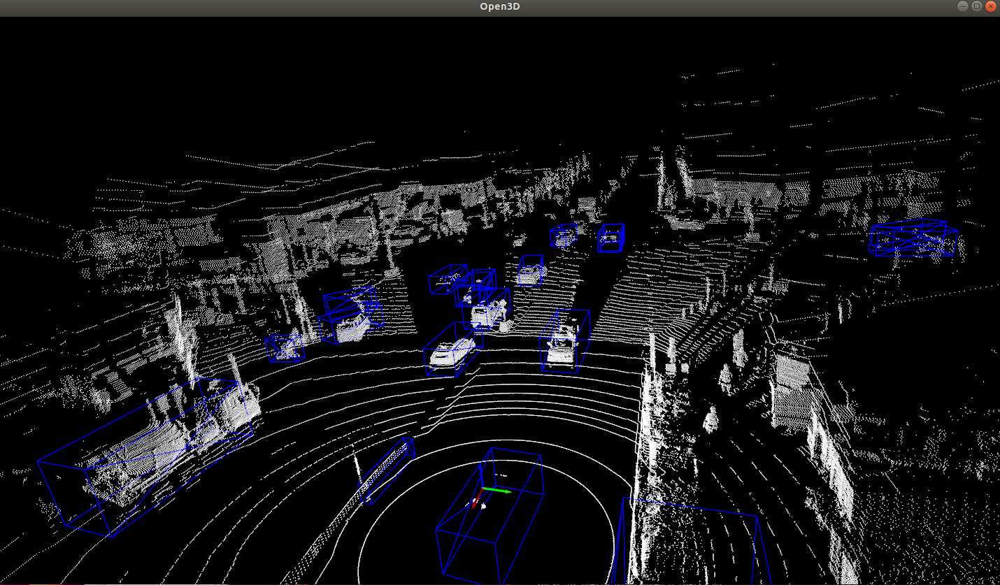

# 第6回 AIエッジコンテスト Vertical-Beach 実行方法

## 準備するもの
- Xilinx KV260
  - 電源ケーブル・MicroUSBケーブル
- 16GB以上のMicroSDカード

## SDイメージの書き込み・起動確認
`sd.img`を[Balena Etcher](https://www.balena.io/etcher)やddコマンドSDイメージに書き込む。KV260とホストPCをUSBケーブルで接続し、KV260の電源ケーブルを接続する。

電源を投入するとシリアルコンソールで起動ログを確認する。ここではLinuxに入っている`screen`をしようしてシリアルコンソールに接続する。
```bash
sudo screen /dev/ttyUSB1 115200
```
起動ログを確認する。この時点で起動がうまくいっていない場合、KV260のファームウェアを更新する必要がある。[Xilinx公式Wiki](https://xilinx-wiki.atlassian.net/wiki/spaces/A/pages/1641152513/Kria+K26+SOM#Boot-Firmware-Updates)より`BOOT_xilinx-k26-starterkit-v2022.1-07250622_update2.BIN`に更新することでブートが正常にできることを確認している。  


初回起動時はパスワードの設定を求められるので適宜設定する。

## FPGAイメージのロード
KV260では`xmutil`コマンドを使用して`/lib/firmware/xilinx/`以下に配置したFPGAのビットストリーム・デバイスツリーをロードすることができる。起動時にはベースプロジェクトに含まれている`xilinx-kv260-starterkit-20221`のFPGAビットストリームが書き込まれているが、これをアンロードし、コンテストで使用するFPGAビットストリームに書き換える。

```sh
sudo xmutil listapps
sudo xmutil unloadapp
sudo xmutil loadapp riscv_and_dpu2
```

## RISCVの実行確認
RISCV単体での実行を確認することができる。簡単な浮動小数点数の足し算をRISCV上で実行するテストプログラムを実行する。
```
cd test_riscv
g++ test.cpp
sudo ./a.out
```

## 点群データ推論アプリケーションの実行
採取成果物である点群データ推論アプリケーションの実行を行う。
```sh
cd mypointpillars
```

まず最初に`/run/media/mmcblk0p1/dpu.xclbin`にビットストリームイメージをコピーする必要がある。
```sh
sudo ./setup.sh
```

再度アプリケーションをビルドする場合は下記のシェルスクリプトでビルドできる。  
```sh
sh build_riscv.sh #RISCVを使用する場合
sh build.sh #RISCVを使用しない場合
```
RISCVを使用する場合、アプリケーションの実行には`sudo`権限が必要となる。  
推論アプリケーションの実行形式は以下の通り。  
```sh
sudo ./test <.bin point cloud file> <output file>
```
SDイメージに同梱している`signate.bin`点群データを使用した場合の実行例は以下の通り。  
```
sudo ./test signate.bin out.txt
riscv: 375[ms]
predict: 789[ms]
predicted log is written in out.txt
```

`out.txt`は以下のようになる。それぞれのbbox情報は`(center_x, center_y, min_z, size_x, size_y, size_z, y-axis-rotation)`を表している。  
```
label: 0 bbox: -13.8233 -7.192 -2.12334 1.95018 4.60718 1.72271 1.57 0 0 score: 0.952574
label: 0 bbox: 8.36732 -9.98468 -2.44634 2.07595 4.60718 1.72271 1.5075 -4 -0.1875 score: 0.904651
label: 0 bbox: -15.128 -0.247999 -1.97797 2.07595 4.90432 2.07798 4.71159 3.5625 -0.25 score: 0.880797
label: 0 bbox: -31.992 -7.00868 -1.85588 1.95018 4.60718 1.83381 1.7575 -0.8125 0.0625 score: 0.880797
label: 0 bbox: -21.2633 -7.688 -2.07122 1.95018 4.60718 1.83381 1.5075 -0.8125 -0.1875 score: 0.880797
label: 0 bbox: 10.9767 -6.696 -2.17882 1.95018 4.60718 1.61833 1.57 -1.9375 -0.1875 score: 0.817575
label: 0 bbox: -18.9127 -18.6 -2.6687 1.95018 4.60718 1.95208 1.195 -2.625 -1.9375 score: 0.817575
（以下省略）
```

## 推論結果の可視化
可視化ツールを使用して推論結果を可視化することができる。
詳細については[visualize_util/README.md](https://github.com/Vertical-Beach/ai-edge-contest6/visualize_util)を参照。  

- 俯瞰視点でのbbox描画、前方方向画像へのbbox描画
```
python visualize_pred.py --out_dir pred --train_or_val val --dataset_dir /media/lp6m/HDD6TB/aiedge6/materials/train/3d_labels/ --result_json ./data/result.json --mode both
```


- Open3Dを用いたGUIで視点を移動しながら推論結果を確認
```
python visualize_gui.py --train_or_val val --dataset_dir /media/lp6m/HDD6TB/aiedge6/materials/train/3d_labels/ --mode pred --lidar_file em5VCQcE1fwFkTHI4wZ0Tm5y_0.bin --result_json ./data/result.json
```
